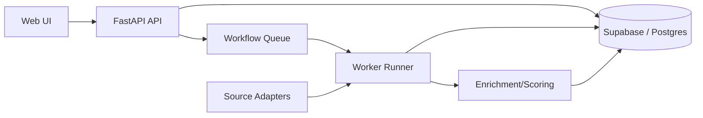

# Job Intelligence Agent Architecture

This document captures the evolving architecture decisions based on `genesis.md` and our current plan.

## Scope (Phase 1)

- Manual URL ingestion (primary input)
- Server-side workflows to process and enrich data
- Minimal web UI for manual intake and job list
- FastAPI + Supabase Postgres + Supabase Auth
- In-repo database package with Alembic migrations

## Key Decisions (From Q&A)

1. Frontend: Real web frontend (React + Vite).
2. Backend: FastAPI + Supabase Postgres with a `db` package and in-repo Alembic migrations.
3. Auth: Supabase Auth with JWKS verification (recommended modern approach).
4. UI: Minimal UI to start, but must include a job list view.
5. Data streams: Not fixed yet; we will start with whatever APIs are viable and expand.
6. Agent interaction: Server-side workflows (not client-triggered pipelines).

## System Outline

### Ingestion and Processing

- Manual URL submission via web UI.
- Server stores submission, fetches page content, and creates a normalized job record.
- Workflow stages (server-side):
  - Ingestion
  - Extraction
  - Enrichment
  - Scoring
  - Shortlisting

### Storage

- Supabase Postgres as source of truth.
- Alembic-managed migrations in-repo.
- Core tables (from `genesis.md`):
  - `jobs`
  - `manual_submissions`
  - `companies`
  - `enrichments`
  - `fit_scores`
  - `resume_variants`
  - `user_preferences`

### Auth

- Supabase Auth JWT verification via JWKS.
- API should require a valid Supabase user token for all non-health endpoints.

## API Surface (Initial)

- `GET /health`
- `POST /jobs/manual` (manual URL submission)
- `GET /jobs` (list job records for review)

## UI (Initial)

- Manual URL intake form
- Jobs list view (basic list; detail view later)

## Open Questions

- Which data sources and APIs to integrate first (e.g., Greenhouse, Lever, RSS, board APIs)?
- Queue/worker infrastructure: Celery+Redis vs Supabase queue-table pattern.
- Which enrichment models to run locally vs hosted.

## ORM and Migrations Rationale

We are using SQLAlchemy + Alembic because the backend is FastAPI/Python and this is the native, well-supported ORM/migrations stack for that ecosystem. Prisma is excellent but is TypeScript/Node-first and would introduce a second toolchain plus schema/migration indirection in a Python backend. Keeping SQLAlchemy + Alembic keeps the backend cohesive, integrates cleanly with Supabase Postgres, and keeps migrations in-repo.

## App Structure (Current)

- `apps/api`: FastAPI backend
- `apps/api/app`: API source
- `apps/api/app/routes`: HTTP routes
- `apps/api/app/db`: DB session/deps
- `apps/api/app/services`: service layer (ingestion/enrichment stubs)
- `apps/api/app/workers`: workflow runner + pipeline stubs
- `apps/web`: React frontend (Vite)
- `apps/web/src`: UI source
- `packages/db`: SQLAlchemy models + Alembic migrations
- `packages/db/alembic`: Alembic config and versions

## Core Components (Mermaid)



## Runtime Processes

- API server: serves HTTP endpoints for UI/CLI and writes to the workflow queue.
- Web UI: optional client for manual intake and job review.
- Worker process: continuously claims tasks from the queue and executes adapters/enrichment.

## Scheduling Options (Periodic Pipeline)

Option 1: Local scheduler (CLI + cron).
- Pros: fast to implement, easy to test, minimal infra.
- Cons: schedule lives outside the app, no central audit, not hosted.

Option 2: Render Cron Job (HTTP trigger).
- Pros: hosted schedule, simple trigger.
- Cons: Render-specific, no per-user cadence without DB logic, limited audit.

Option 3: DB-backed schedule (policy in DB + trigger).
- Pros: central/auditable, multi-user, UI-configurable later.
- Cons: more schema/code, still needs a trigger.

Current choice: Option 1 for local runs. Option 2/3 can be layered later.

## Scripts Directory (Purpose)

- `scripts/start_api.sh`: bootstraps venv, installs deps, runs API server.
- `scripts/start_web.sh`: installs web deps and runs Vite dev server.
- `scripts/start_worker.sh`: runs the worker loop (calls CLI).
- `scripts/cli.py`: developer CLI wrapper for seed/enqueue/run-worker.
- `scripts/run_worker.py`: worker loop implementation.
- `scripts/seed_sources.py`: seed sources and user_sources.
- `scripts/enqueue_all_sources.py`: enqueue fetches for all enabled sources.

## Keyword Search Profiles
We use `search_profiles` in `config/sources.yaml` or DB-backed user config to build compound keyword searches across sources. Each profile includes role keywords, sector keywords, and optional location/remote hints. Adapters map these to source-specific query parameters (e.g., Adzuna `what` + `where`, Jooble `keywords` + `location`).

Example profile:
```yaml
search_profiles:
  - role_keywords: ["technical product manager"]
    sector_keywords: ["climate"]
    location: Los Angeles, CA
    remote: true
```

## DB-backed Source Config
User-configurable source config is stored in the database and editable via the UI. The API loads and applies this config to `sources` and `user_sources` records, merging secrets from `.env` for providers that require API keys.

## Phase Roadmap (Aligned to Current Scaffold)

Phase 1 (Current)

- Manual URL ingestion
- Workflow queue + server-side runner
- Minimal UI: manual intake + job list
- Fit scoring/enrichment stubs

Phase 2

- Add first external data source (API or RSS)
- Company enrichment
- Structured resume storage
- Tailoring generation for top roles

Phase 3

- Browser extension for “Send to Job Agent”
- Preference learning + analytics dashboard
- Expanded ingestion sources

## Data Flow (Current)

- Manual URL submitted in web UI
- API writes `manual_submissions`
- API enqueues a `workflow_queue` task (`manual_ingest`)
- Worker pulls queued task and marks it running
- Next step: implement task dispatch that creates/updates `jobs` and triggers enrichment/scoring

## Immediate Next Implementation

- Implement `manual_ingest` task handler to fetch the job page, extract readable text, and create/update a `jobs` record. Store raw page snapshot for traceability, then enqueue enrichment/scoring tasks.

## Queue Lease/Locking

- The workflow queue is database-backed.
- Workers claim tasks by leasing them for a fixed window (e.g., 5 minutes).
- Leasing prevents double-processing if multiple workers run.
- If a worker crashes, the lease expires and another worker can reclaim the task.
- The queue tracks `status`, `attempts`, `lease_expires_at`, and `last_error`.
